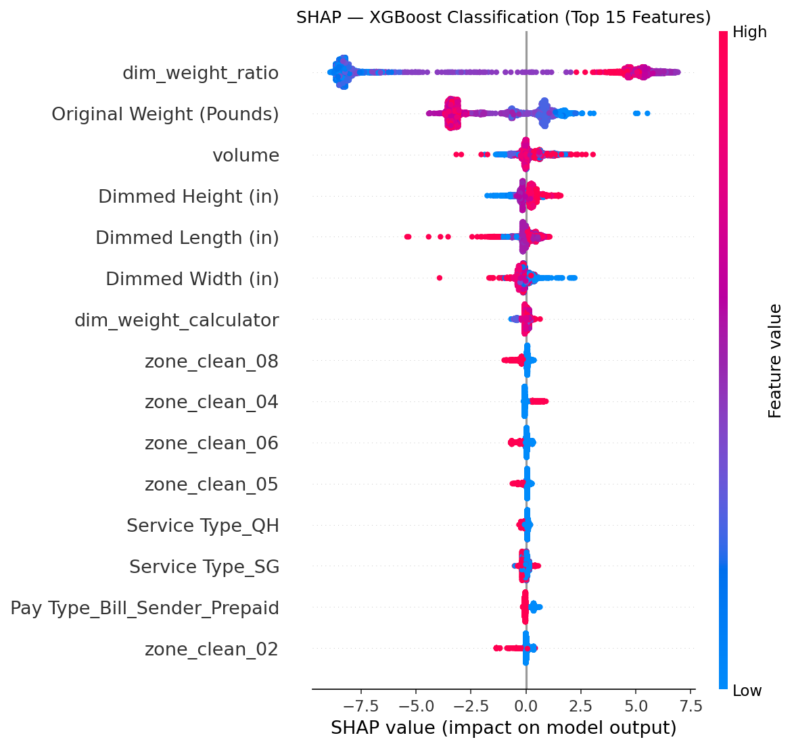
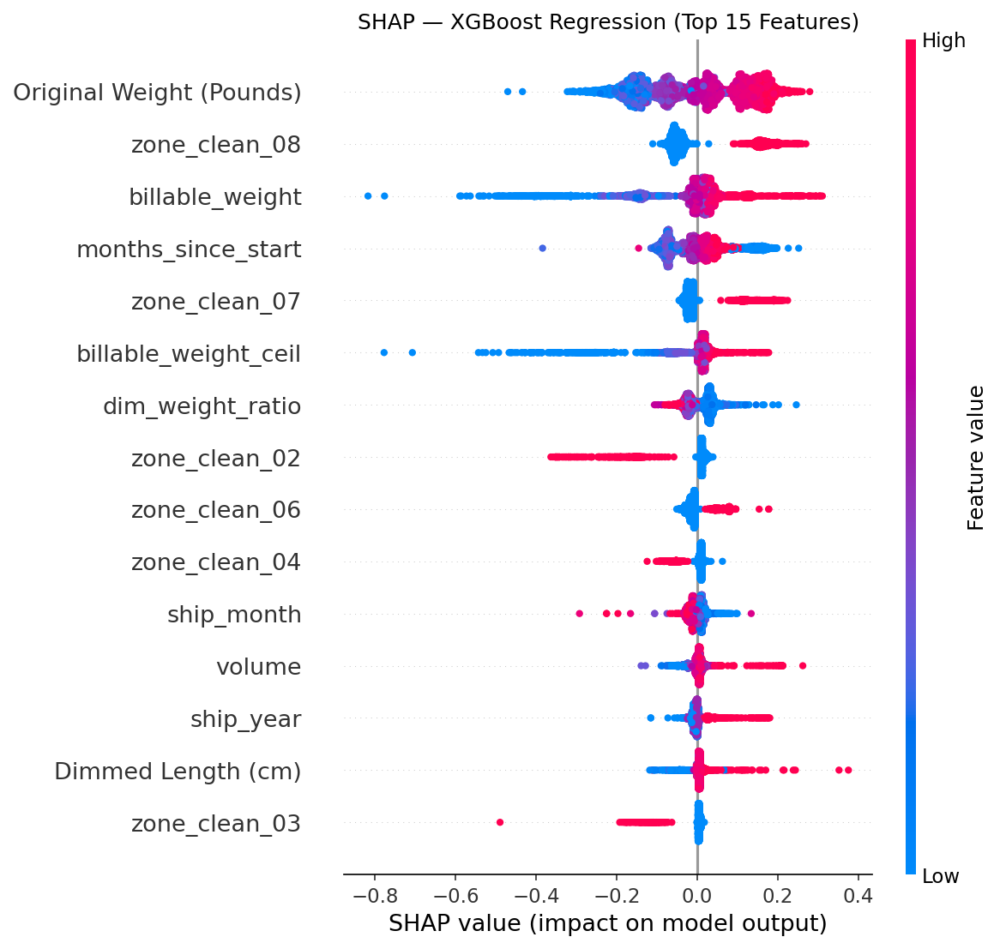

<div align="center">

# FedEx DIM Weight & Shipping Cost Predictor

### End-to-end machine learning on 57,000 real-world shipments, from raw invoice data to an analysis and audit dashboard

[](https://python.org)
[](https://lightning.ai)
[](https://xgboost.readthedocs.io)
[](https://scikit-learn.org)
[](LICENSE)

</div>

---

## The Problem

FedEx charges by **dimensional (DIM) weight** when a package's volume exceeds a threshold relative to its actual weight, often resulting in shipping costs far above what the actual weight alone would suggest. For high-volume shippers like furniture and mattress manufacturers, this creates a significant and largely *avoidable* cost: if you know a package will be DIM-flagged before it ships, you can repack it.

This project uses 25 months of real FedEx invoice data (April 2024 to April 2026) from a mattress manufacturing company to build two ML models that power an [analysis and audit dashboard](https://github.com/Fcorre000/dim-risk-engine):

| Task | Type | Target | Business Value |
|------|------|--------|----------------|
| **Task 1** | Binary Classification | DIM flag (Y/N) | Identify which packages were or would be DIM-flagged; disagreements with FedEx become a review queue |
| **Task 2** | Regression | Net shipping charge ($) | Predict expected cost to flag pricing anomalies and inform rate negotiations |

> **Key stat from the data:** 32% of domestic shipments are DIM-flagged (2.12:1 class imbalance). Net charges range from $0 to $200 with a skewness of 23.1, requiring log-transform for regression.

---

## Results (Test Set)

### Task 1: DIM Flag Classification

| Model | Accuracy | Precision | Recall | F1 | ROC AUC |
|-------|----------|-----------|--------|----|---------|
| Logistic Regression *(baseline)* | 0.9858 | 0.9629 | 0.9940 | 0.9782 | 0.9978 |
| AdaBoost | 0.9946 | 0.9918 | 0.9913 | 0.9915 | 0.9987 |
| **XGBoost** | **0.9974** | **0.9951** | **0.9967** | **0.9959** | **0.9997** |
| PyTorch FFNN | 0.9889 | 0.9742 | 0.9918 | 0.9829 | 0.9991 |

### Task 2: Net Charge Regression

| Model | MAE | RMSE | R² |
|-------|-----|------|----|
| Linear Regression *(baseline)* | $7.14 | $11.81 | 0.6763 |
| AdaBoost | $10.19 | $16.08 | 0.3993 |
| **XGBoost** | **$3.88** | **$7.60** | **0.8658** |
| PyTorch FFNN | $5.07 | $9.96 | 0.7695 |

> XGBoost is the best model on both tasks. Classification AUC of 0.9997 means the model nearly perfectly reproduces FedEx's DIM rule, and the 0.03% of disagreements form the review queue for the audit dashboard. XGBoost regression predicts shipping cost within **$3.88 on average** across a $0 to $200 range.

---

## SHAP Feature Importance

SHAP beeswarm plots reveal what drives each model's decisions:

<div align="center">
<table>
<tr>
<td><strong>Classification</strong></td>
<td><strong>Regression</strong></td>
</tr>
<tr>
<td></td>
<td></td>
</tr>
</table>
</div>

**Classification** is dominated by `dim_weight_ratio`, which directly encodes the FedEx DIM trigger rule (`volume/139 > actual_weight`), confirming the model learned the correct decision boundary.

**Regression** top drivers are `Original Weight`, pricing zone (`zone_clean_08`, `zone_clean_07`), `billable_weight`, and the time features (`months_since_start`, `ship_month`, `ship_year`). The time features capture FedEx rate card hikes (~5 to 7% annually), monthly fuel surcharges (linked to DOE diesel prices), and peak season surcharges, together explaining a ~40% mean-charge swing across the 25-month window. No leakage features appear in either plot.

---

## Tech Stack

```
Data & Features      scikit-learn · pandas · NumPy · SHAP
Gradient Boosting    XGBoost · AdaBoost (scikit-learn)
Deep Learning        PyTorch Lightning · AdamW · Cosine LR Schedule
Visualization        Matplotlib · TensorBoard
Environment          Python 3.10 · conda
```

---

## Dataset

- **Source:** Real FedEx invoice export (domestic shipments, mattress manufacturer)
- **Size:** 57,600 shipments x 66 columns (25 months, April 2024 to April 2026)
- **After filtering:** 56,885 domestic shipments (removed 270 non-transport entries, 176 international, 285 charges above $200)
- **Split:** 80/10/10 stratified on DIM flag (Train: 45,508 / Val: 5,688 / Test: 5,689)
- **Not included in repo** (proprietary invoice data). Preprocessed parquet splits are provided in `data/`.

**Key raw features:**

```
Numeric       actual weight, height (cm), width (cm), length (cm)
Categorical   pricing zone (02 to 08+), service type (Ground / Home Delivery / etc.),
              pay type (Sender / Third Party / Recipient)
Temporal      invoice month (yyyymm format)
```

**Engineered features (42 total after one-hot encoding):**

```python
volume              = height * width * length              # package volume in cubic inches
dim_weight_calculator = volume / 139                        # FedEx domestic DIM divisor
dim_weight_ratio    = dim_weight_calculator / actual_weight  # >1.0 triggers DIM billing
billable_weight     = max(actual_weight, dim_weight_calculator)  # what FedEx prices on
billable_weight_ceil = ceil(billable_weight)                 # matches FedEx rate-card rounding
has_dimensions      = 1 if all dims > 0, else 0             # binary flag
ship_year           = invoice_month // 100                   # annual rate card changes
ship_month          = invoice_month % 100                    # monthly fuel surcharge cycles
months_since_start  = (year - 2024) * 12 + month            # linear time index for trend
```

---

## Repository Structure

```
shipping-dim-xgboost-pytorch/
│
├── notebooks/
│   ├── 01_eda.ipynb                  # Exploratory analysis & data audit
│   ├── 03_baseline_models.ipynb      # Logistic + Linear Regression
│   ├── 04_gradient_boosting.ipynb    # AdaBoost + XGBoost + SHAP
│   └── 07_final_comparison.ipynb     # Full model comparison on test set
│
├── src/
│   ├── 02_preprocessing.py           # Feature engineering & parquet generation
│   ├── 05_pytorch_classification.py  # PyTorch Lightning FFNN, DIM classifier
│   └── 06_pytorch_regression.py      # PyTorch Lightning FFNN, charge regressor
│
├── figures/                          # EDA plots, confusion matrices, SHAP beeswarms
├── models/                           # Saved checkpoints (.pkl / .ckpt / preprocessor)
├── data/                             # Preprocessed parquet splits (scaled + unscaled)
├── documentation/                    # EDA notes, preprocessing decision log
├── requirements.txt
└── README.md
```

---

## Quickstart

```bash
# 1. Clone and set up environment
git clone https://github.com/yourusername/fedex-dim-predictor.git
cd fedex-dim-predictor
conda create -n fedex-ml python=3.10 && conda activate fedex-ml
pip install -r requirements.txt

# 2. Run preprocessing (generates train/val/test parquets)
python src/02_preprocessing.py

# 3. Run baseline models
jupyter notebook notebooks/03_baseline_models.ipynb

# 4. Run gradient boosting + SHAP analysis
jupyter notebook notebooks/04_gradient_boosting.ipynb

# 5. Train PyTorch Lightning models
python src/05_pytorch_classification.py
python src/06_pytorch_regression.py

# 6. View full comparison on test set
jupyter notebook notebooks/07_final_comparison.ipynb
```

> **GPU Note:** PyTorch Lightning will automatically use MPS (Apple Silicon) or CUDA GPU if available. Training completes in ~2 minutes on CPU.

---

## ML Design Decisions

**Why compare gradient boosting vs. deep learning on tabular data?**
Tree-based ensembles (especially XGBoost) tend to outperform neural networks on structured tabular data. This project tests that assumption directly on a real dataset, and confirms it: XGBoost wins on both tasks.

**Leakage guard:**
`Shipment Rated Weight` is derived from the DIM flag (correlation ~0.95) and is excluded from all models. SHAP analysis verified no leakage features appear in either model's top drivers.

**Time features for regression:**
FedEx rate cards update annually, fuel surcharges recalculate monthly, and holiday season adds surcharges. Adding `ship_year`, `ship_month`, and `months_since_start` reduced XGBoost regression MAE from $5.35 to $3.36 on validation (37% improvement) by capturing these pricing dynamics.

**Log-transformed regression target:**
Net charge skewness is 23.1, an extreme right tail. `np.log1p()` compresses the distribution for training; `np.expm1()` recovers dollar amounts for evaluation.

**$200 cap on net charges:**
The top 0.50% of charges (285 shipments above $200) are removed. This cap improved XGBoost regression by ~10% on the previous dataset and the skewness profile is unchanged, so the cap still applies.

**SHAP for interpretability:**
XGBoost feature importances are explained using SHAP beeswarm plots, making the model's decisions auditable, which is critical for a tool used in an operational/audit context.

---

## Use Case: Analysis & Audit Dashboard

The trained models power a [dashboard](https://github.com/Fcorre000/dim-risk-engine) that takes monthly FedEx invoice data and provides:

- **DIM classification audit:** Compare model predictions against FedEx's DIM flags. Agreements confirm correct billing; disagreements surface packages worth reviewing (potential billing errors or repacking opportunities).
- **Cost prediction analysis:** Flag shipments where actual charges deviate significantly from predicted costs, highlighting potential overcharges or negotiation leverage for rate discussions.
- **Trend analysis:** Time features let the model track rate card changes and fuel surcharge fluctuations, enabling month-over-month cost drift detection.

---

## Author

**Fernando Correa**
B.S. Computer Science · University of Texas at Arlington

---

<div align="center">
<sub>Built with real data, real business constraints, and no clean benchmark to hide behind.</sub>
</div>
